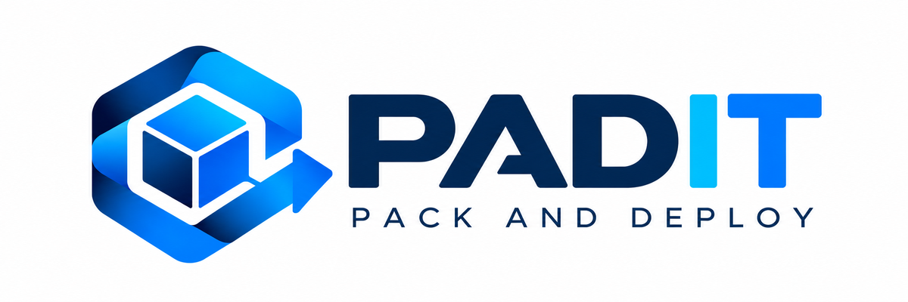

  

# PADIT — Pack And Deploy

PADIT is a community-maintained software deployment and lifecycle management solution for Windows environments.

The project is derived from WAPT Community 1.8.2, originally developed by Tranquil IT. Its purpose is to preserve the Community Edition, maintain compatibility with existing deployments and upgrade paths, and progressively modernize the platform for current operating systems and environments.

PADIT is developed with continuity, migration and long-term operability in mind. Existing WAPT Community installations should be able to evolve progressively, while new deployments can be installed on newer operating systems. The project also includes validated backup and restore tooling to support migration, recovery and disaster-recovery scenarios.

## Project status

PADIT is actively maintained and modernized incrementally.

Compatibility, migration and reproducibility are prioritized. Platform migrations and significant compatibility changes are validated before moving to the next stage.

Stable milestones and pilot releases are published through the GitHub Releases section of this repository.

## Compatibility

PADIT currently preserves a number of historical WAPT technical identifiers, paths, configuration names and interfaces where changing them would break compatibility with existing installations.

As a result, references to `WAPT`, `wapt`, or related historical identifiers may still appear internally even though the public product identity is PADIT.

This is intentional during the transition. These historical identifiers will be progressively reviewed and replaced with PADIT equivalents where this can be done safely, without breaking compatibility, migration paths or existing deployments.

## Releases

Published builds and project milestones are available from the GitHub Releases section.

Release artifacts are produced from controlled project sources and validated as part of the modernization process.

## Licensing

PADIT is derived from WAPT Community and is distributed under the GNU General Public License, version 3 or (at your option) any later version.

See `COPYING.txt` for the complete license text and information about third-party components.

## Project history

PADIT originates from the WAPT Community project developed by Tranquil IT.

WAPT Community 1.8.2 is the historical compatibility baseline from which this project is being preserved and modernized.

Historical upstream resources:

- Original WAPT repository: https://github.com/tranquilit/WAPT
- WAPT website: https://www.wapt.fr/
- Historical WAPT 1.8 documentation: https://www.wapt.fr/en/archives/doc-1.8/

PADIT is an independent community-maintained project and is not the current official WAPT product distributed by Tranquil IT.

## Main features

### For system administrators

- Install software and configurations silently.
- Maintain an installed base of software and configurations.
- Configure software at system and user level.
- Remove unwanted or obsolete software and configurations silently.
- Provide users with a controlled self-service software installation interface.
- Reduce bandwidth usage on remote sites through centralized package management.

### For IT security teams

- Maintain greater visibility over the installed software base.
- Help systems converge toward an organization's software and security standards.
- Reduce reliance on local administrator privileges.
- Deploy software updates and security fixes centrally.
- Provide inventory and audit information about managed endpoints.

### For end users

- Receive software configured for the organization's environment.
- Install authorized applications through PADIT Self Service.
- Benefit from more consistent and predictable software configurations.
- Reduce dependency on manual intervention from IT support teams.
